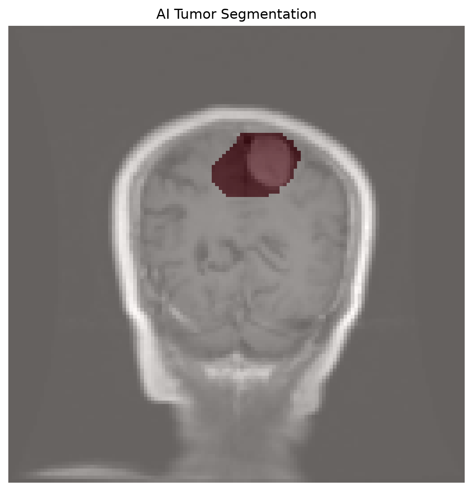
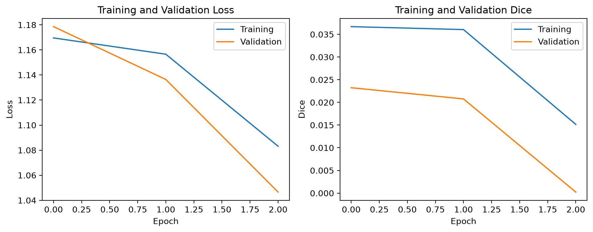

# Brain MRI Tumor Segmentation using U-Net and 3D Slicer

A medical imaging AI project for automatic brain tumor segmentation from MRI images using a lightweight U-Net model. The AI-generated segmentation was subsequently imported and visualized in 3D Slicer.

## Project Overview

This project demonstrates an end-to-end workflow for medical image segmentation:

1. MRI image preprocessing
2. Binary tumor mask preparation
3. U-Net model development
4. Model training using TensorFlow/Keras
5. AI-based tumor prediction
6. Prediction threshold evaluation
7. AI segmentation visualization in 3D Slicer

The project was developed as a lightweight CPU-based prototype.

## Dataset

The project uses the **BRISC2025** brain MRI dataset.

BRISC2025 contains contrast-enhanced T1-weighted brain MRI images with corresponding tumor segmentation masks.

The dataset is **not included in this repository**. It must be downloaded separately.

## Method

### Image Preprocessing

- Converted MRI images to grayscale
- Resized images to `128 × 128`
- Normalized pixel values to `[0, 1]`
- Converted segmentation masks into binary masks
- Used bilinear interpolation for MRI images
- Used nearest-neighbor interpolation for segmentation masks

### Model

A lightweight **U-Net convolutional neural network** was implemented using TensorFlow/Keras.

The model contains:

- Encoder blocks for feature extraction
- Max-pooling for downsampling
- Decoder blocks for reconstruction
- Skip connections
- Sigmoid output for binary segmentation

### Training

Training configuration:

| Parameter | Value |
|---|---|
| Training images | 100 |
| Validation images | 25 |
| Image size | 128 × 128 |
| Batch size | 8 |
| Epochs | 10 |
| Optimizer | Adam |
| Loss | Binary Cross-Entropy + Tversky Loss |
| Framework | TensorFlow / Keras |

Tversky loss was used to help address the strong foreground/background imbalance commonly encountered in medical image segmentation.

## Results

The model learned to produce tumor predictions from previously unseen validation images.

The best tested prediction threshold was **0.45**, producing a validation Dice score of approximately **0.173** on the small validation subset.

### AI Segmentation

The following image shows the MRI, AI-predicted tumor mask, and resulting segmentation overlay.



### Training Curves



## 3D Slicer Integration

The AI-generated tumor mask was imported into **3D Slicer** and converted into a Slicer segmentation.

The Slicer files included in this repository demonstrate the visualization of the actual AI-generated segmentation.

Files:

- `AI_Tumor_Segmentation.seg.nrrd`
- `AI_tumor_segmentation_scene.mrb`

The segmentation shown in Slicer is the **model prediction**, not the ground-truth annotation.

## Tools and Technologies

- Python
- TensorFlow
- Keras
- NumPy
- Pillow
- Matplotlib
- Jupyter Notebook
- 3D Slicer
- U-Net
- Medical image segmentation
- Tversky loss

## Project Structure

```text
brain-mri-tumor-segmentation/
│
├── data/
│
├── notebooks/
│   └── brain_tumor_segmentation.ipynb
│
├── results/
│   ├── AI_Tumor_Segmentation.seg.nrrd
│   ├── AI_tumor_segmentation_scene.mrb
│   ├── ai_predicted_tumor_mask.png
│   ├── ai_segmentation_overlay.png
│   └── training_curves.png
│
├── src/
│
├── README.md
└── .gitignore